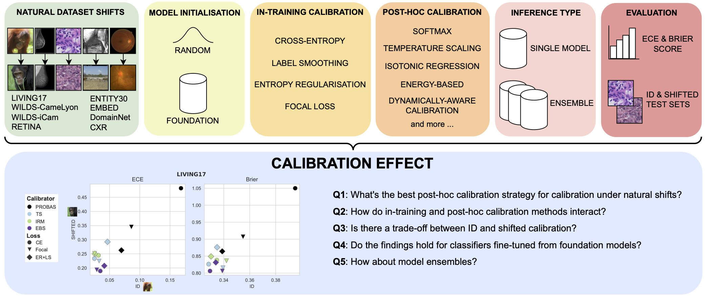

# Where are we with calibration under dataset shift in image classification?

This repository contains the code associated with the paper: 'Where are we with calibration under dataset shift in image classification?' [link](https://arxiv.org/abs/2507.07780)



## Overview
The repository is divided in two main parts:
* The [classification/](classification/) folder contains all the code related to classification
* The [calibration/](calibration/) folder contains all the code related to inference and calibration
* The [plotting_notebooks](plotting_notebooks) contains all the plotting notebooks.


## Prerequisites

### Code dependencies
The code is written in PyTorch, with PyTorch Lightning. 
You can install all our dependencies using the pip requirements file `requirements.txt`. 

### Datasets
You will need to download the relevant datasets to run our code. 
All datasets are publicly available and be downloaded at:
* For the CXR: CheXpert [https://stanfordaimi.azurewebsites.net/datasets/8cbd9ed4-2eb9-4565-affc-111cf4f7ebe2](https://stanfordaimi.azurewebsites.net/datasets/8cbd9ed4-2eb9-4565-affc-111cf4f7ebe2) and [MIMIC-CXR](https://mimic.mit.edu/docs/iv/modules/cxr/)
* EMBED [https://pubs.rsna.org/doi/full/10.1148/ryai.220047](https://pubs.rsna.org/doi/full/10.1148/ryai.220047), [https://github.com/Emory-HITI/EMBED_Open_Data/tree/main](https://github.com/Emory-HITI/EMBED_Open_Data/tree/main)
* For the RETINA dataset you'll need: Kaggle EyePacs [https://www.kaggle.com/c/diabetic-retinopathy-detection/data](https://www.kaggle.com/c/diabetic-retinopathy-detection/data), Kaggle Aptos [https://www.kaggle.com/competitions/aptos2019-blindness-detection/data](https://www.kaggle.com/competitions/aptos2019-blindness-detection/data) and MESSIDOR-v2 [https://www.adcis.net/en/third-party/messidor2/](https://www.adcis.net/en/third-party/messidor2/)
* [ImageNet](https://www.image-net.org)

The other datasets (Wilds, DTD) will automatically get downloaded the first time you use them.

Once you have downloaded the datasets, please update the corresponding paths (EMBED_ROOT, MIMIC_ROOT, CHEXPERT_ROOT) ath the top of the `mammo.py` and `xray.py` files.

Additionally, for EMBED you will need to preprocess the original dataframes by running the `data_handling/csv_generation_code/generate_embed_csv.ipynb` notebook. For RETINA, please run the `data_handling/csv_generation_code/retina_df_creation.ipynb` notebook to prepare the dataframe.


## Instructions to reproduce experiments

Here we detail the workflow to reproduce our experiments. We take the example of WILDS-CameLyon.

1. First retrieve the correct experiment configuration files. We use [hydra](https://hydra.cc/docs/1.0/advanced/override_grammar/basic/) for config management. All configs file can be found in [configs/experiment](/configs/experiment/). There are named like their datasets. For CameLyon use `base_camelyon.yml`
2. Launch training for all classifiers. Taking the example of training ResNet50 here are the commands you should run:

```
python classification/train.py experiment=base_camelyon model.encoder_name=resnet18 trainer.entropy_regularisation=$ER trainer.label_smoothing=$LABEL_SMOOTHING
python classification/train.py experiment=base_camelyon model.encoder_name=efficientnet_b0 trainer.use_focal_loss=True
```
To simplify things we have created a bash script that will launch training of all models needed [launch_train_local.sh](/launch_train_local.sh). The training code logs metrics to weights & biases, it also uses it to check if runs with the same config have already been run and successfully finished, if yes training will be skipped by default.

3. Repeat the same process for inference. This script takes care of running inference, applying all types of post-hoc calibrators and saves calibration and performance metrics to the model folder. Runs folder are automatically retrieved based on their W&B id. It will throw an error if no run corresponding the specified config is found.
```
python calibration/inference.py experiment=base_camelyon model.encoder_name=resnet18 trainer.entropy_regularisation=$ER trainer.label_smoothing=$LABEL_SMOOTHING
python calibration/inference.py experiment=base_camelyon model.encoder_name=efficientnet_b0 trainer.use_focal_loss=True
```

4. Plot the results using [plotting_notebooks/main_plots.ipynb](/plotting_notebooks/main_plots.ipynb)

5. Optionally, you can also run the ablation of OOD size using [calibration/ablation_ebs.py](/calibration/ablation_ebs.py) and plot the results with [plotting_notebooks/ablation.ipynb](/plotting_notebooks/ablation.ipynb)

6. For ensemble inference you should run [calibration/ensemble_run.py](/calibration/ensemble_run.py), by the default this will run inference for all datasets. It assumes all ensemble members have already been trained before. Results can then be plotting with [plotting_notebooks/ensemble.ipynb](/plotting_notebooks/ensemble.ipynb).
 
